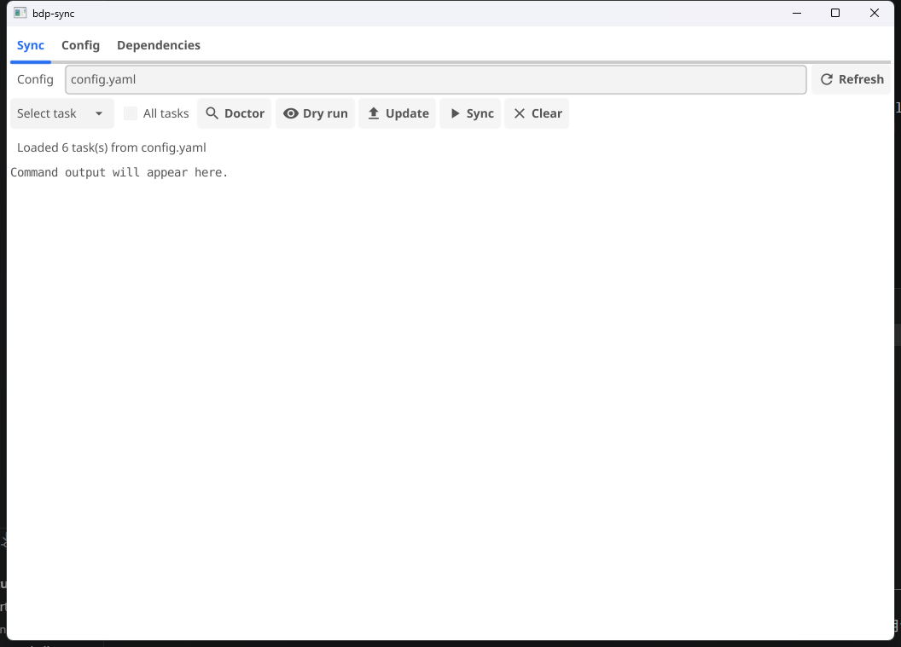

# bdp-sync.exe

`bdp-sync.exe` 是一个 Windows 桌面同步工具，用 AList WebDAV 和 rclone 把本地文件夹备份到百度网盘。普通使用不需要打开终端：把 `bdp-sync.exe`、`config.yaml` 和 `.env` 放在同一目录，双击 exe 即可打开窗口。



## 快速开始

1. 准备好 AList，并在 AList 里挂载百度网盘。
2. 把 AList 的 WebDAV 密码写进同目录的 `.env`：

   ```text
   ALIST_PASSWORD=your_alist_webdav_password
   ```

3. 按下面示例修改 `config.yaml`，然后双击 `bdp-sync.exe`。

```yaml
alist:
  url: "http://127.0.0.1:5244"
  username: "admin"
  password_env: "ALIST_PASSWORD"

tasks:
  - name: "documents"
    local: "D:/Documents"
    remote: "/BaiduPanBackup/Documents"
```

`ALIST_PASSWORD` 是 AList 用户密码，不是百度网盘密码。

## 日常使用

主界面的 `Sync` 标签是日常入口：

- 先点 `Doctor` 检查配置和依赖。
- 不确定会发生什么时，先点 `Dry run` 预览。
- `Update` 只上传新增或变更的本地文件。
- `Sync` 会让网盘端和本地目录保持一致，可能删除网盘端独有文件。
- 只想处理一个文件或文件夹时，用 `Specific`。

`Config` 标签可以用表单或 YAML 编辑配置。`Dependencies` 标签可以检查或安装 `rclone` 和 `alist`。

## 更多文档

- [安装与准备](doc/installation.md): AList、`.env`、`config.yaml` 怎么准备。
- [GUI 细节](doc/gui-details.md): 每个按钮和配置编辑页怎么用。
- [命令行兼容模式](doc/commands.md): 脚本、调试和开发构建命令。
- [项目结构](doc/project-layout.md): 代码目录说明。
